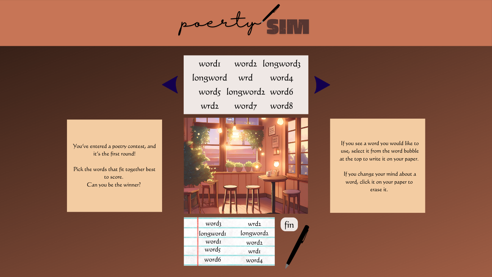

# PoetrySim
A simple game where you select a number of words from a given set. Players are then graded based on how well those words match each other. 

## How to Get Started
- Create an array containing possible words (ex. cuteWords = ['cute1', 'cute2', 'cute3',...] 
- - Have five seperate arrays (ex. cute, happy, sad, dramatic, silly)
- - Have some words shared between arrays (ex. *puppys* are cute **AND** happy)
  - - Have the like words at the end of the array as the very last entries.
- Create a randomized method for generating given words from clouds. (run a for loop for each array, generate a random item number Math.floor(Math.random() * array.length-x) *x is detailed in later point* and update word cloud area to contain list of words
- - When reading for word clouds, do not read the shared words (ex. If the last for words are shared with other clouds, above x would be 5 (-4 to omit the last 4 points, -1 to reflect array starting from 0th position.) 
- Show 1/2 or 1/3 of words at a time for ease of reading and selecting (on mobile). 
- Allow click function to read selected word, delete it from word cloud, and update it within the chosen words area.
- - Allow clicking from within chosen words area to do opposite - read selected word, delete from chosen words area, update to word cloud.
- Scoring runs when words are submitted using button. Scoring runs an if variable, where it measures each word to see if it scores within a certain array type (ex. cuteScore).
- - Do this by seeing if each word is in a set array. If it is, score increase (ex. cuteScore+= 1). If else, move to next. Do this through five word arrays, including all words (even shared words at end).
- Create win condition, detailed below. 
- - Basic function: game returns highest overall score for point total.
- - Advanced funtion: game reutnrs score based on judge. (ex. Sally likes cute words, so only your cuteScore matters).
- Add a base comparison player must beat (ex. 4 points). If player meets or beats, they move to the next level. Each level repeats in the same way, difference being the score to meet or beat increases (ex. 4 becomes 6 becomes 8)

## Wireframe, Concept Art, Logo, etc. 
From wireframes: 

to pseudoCode:

to a couple of mockups: 

 or, even cuter:  

and a simple log:  

with a little help from chatGPT:  

at the end of it all, we had a finished website!  

## Stretch Goals
### Finish earlier than you thought? Try adding these fun features!
- Dynamic Background/Image
- "Judges" with preferred word clouds to match score to
- A simple storyline
- - Or more complex? Maybe have endings? :o
- A real game logo
- Cute mode (that pink more cartoon style one? Yeah. *that* is a stretch)
- Find an API that will generate a random poem to display between levels

## Credits
- Used CanvaPro to complete the concept Art, Logo, and other graphics.
- ChatGPT for help with figuring out some of the meatier code.
- Images generated on Canva
- Pen Writing Sound Effect from <a href="https://pixabay.com/?utm_source=link-attribution&utm_medium=referral&utm_campaign=music&utm_content=38629">Pixabay</a>
- Erasing Sound Effect from <a href="https://pixabay.com/sound-effects/?utm_source=link-attribution&utm_medium=referral&utm_campaign=music&utm_content=103161">Pixabay</a>
- And a special thanks to empty arrays, the Math.random function, and the social zoom room, without which I would be nothing. 